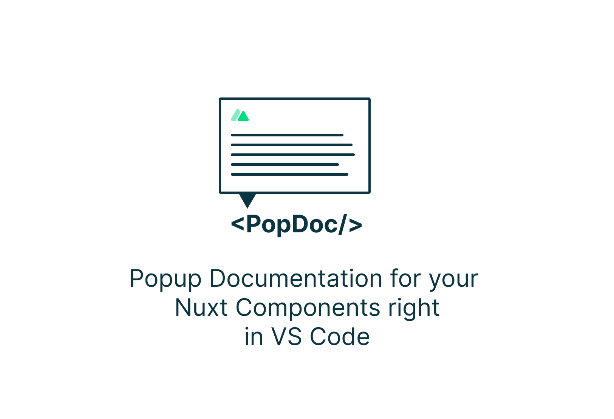
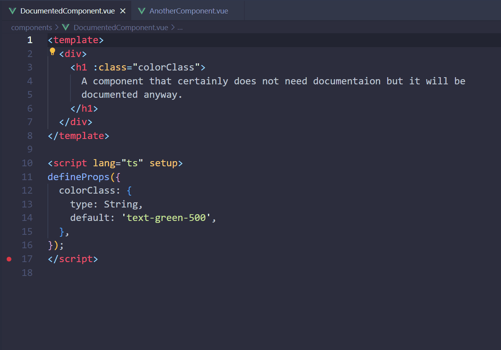

# Nuxt Component Pop Doc README

This extension provides pop-up documentation for Nuxt components on hover right in VS CODE. No need to open the browser to check the documentation.



## Features

* Pop-up documentation for Nuxt components on hover
* Customizable documentation comment template
* Customizable keys to quick insert a PopDoc comment (default: `<pd`)


## Requirements

This extension relies upon the *.nuxt/components.d.ts* file generated by Nuxt to locate the PopDoc documentation comment.

Place all PopDoc comments at the top of the component file, outside of the script and template tags.

## Extension Settings

This extension contributes the following settings:

* `nuxtcomponentpopdoc.enable`: Enable/disable this extension.
* `nuxtcomponentpopdoc.commentTemplate`: The template for the PopDoc comment. 
```txt
<!-- @PopDoc 
 ### Component name
 This is a short description of how to use the component. 
 
 ### Props 
 - example list of props 
 
 ### Emits 
 - example list of events 
 
 ### Slots 
 - example list of slots 
 
 ### Examples 
    ```vue
<template>
 <div>Test</div> 
</template> 
    ```
 -->

 ```

* `nuxtcomponentpopdoc.quickInsertKeys`: The keys to quick insert a PopDoc comment.

## Known Issues


## Release Notes


### 0.0.2

Initial release of Nuxt Component Pop Doc


---